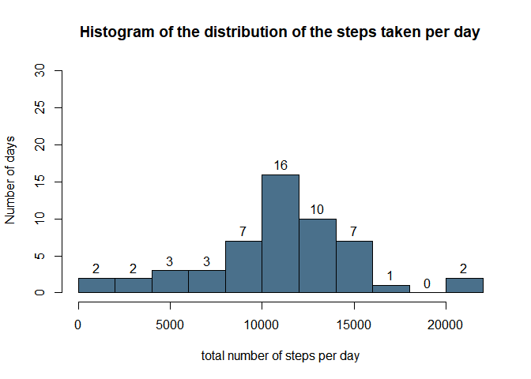
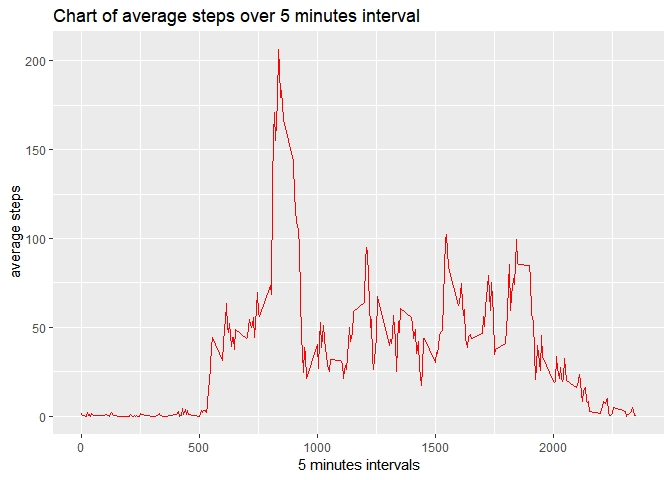
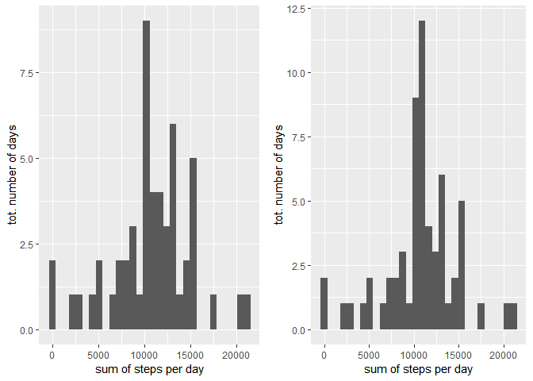
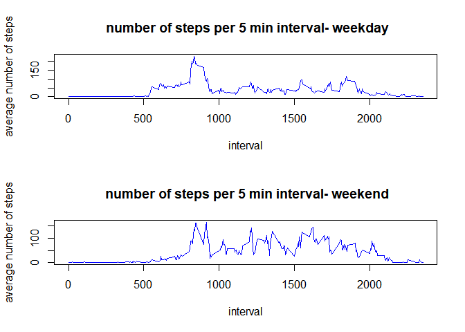

# Reproducible Research- Week 2 assignment

We first read the data file into R, we check it out with the str function
and we convert the date column into date format and the steps column
from integer to numeric:


```r
activity <- read.csv("activity.csv")

str(activity)
```

```
## 'data.frame':	17568 obs. of  3 variables:
##  $ steps   : int  NA NA NA NA NA NA NA NA NA NA ...
##  $ date    : Factor w/ 61 levels "2012-10-01","2012-10-02",..: 1 1 1 1 1 1 1 1 1 1 ...
##  $ interval: int  0 5 10 15 20 25 30 35 40 45 ...
```

```r
activity$date <- as.Date(activity$date, format="%Y-%m-%d")

activity$steps <- as.numeric(activity$steps)

head(activity)
```

```
##   steps       date interval
## 1    NA 2012-10-01        0
## 2    NA 2012-10-01        5
## 3    NA 2012-10-01       10
## 4    NA 2012-10-01       15
## 5    NA 2012-10-01       20
## 6    NA 2012-10-01       25
```

Then we use the tapply function to calculate the total number of steps per day:


```r
steps_day <- tapply(activity$steps, activity$date, sum)
```

we plot our findings on a histogram, using the basic plotting system:


```r
hist(steps_day, main="Histogram of the distribution of the steps taken per day", 
ylab=" Number of days", xlab= "total number of steps per day", col ="skyblue4", 
ylim=c(0, 30), labels=TRUE, breaks=10 )
```

<!-- -->

we then calculate with tapply the mean and the median of the steps per day and convert it from list to dataframe to better visualize it:


```r
steps_day_mean <- tapply(activity$steps, activity$date, mean)

steps_day_mean <- as.data.frame(steps_day_mean)

steps_day_mean
```

```
##            steps_day_mean
## 2012-10-01             NA
## 2012-10-02      0.4375000
## 2012-10-03     39.4166667
## 2012-10-04     42.0694444
## 2012-10-05     46.1597222
## 2012-10-06     53.5416667
## 2012-10-07     38.2465278
## 2012-10-08             NA
## 2012-10-09     44.4826389
## 2012-10-10     34.3750000
## 2012-10-11     35.7777778
## 2012-10-12     60.3541667
## 2012-10-13     43.1458333
## 2012-10-14     52.4236111
## 2012-10-15     35.2048611
## 2012-10-16     52.3750000
## 2012-10-17     46.7083333
## 2012-10-18     34.9166667
## 2012-10-19     41.0729167
## 2012-10-20     36.0937500
## 2012-10-21     30.6284722
## 2012-10-22     46.7361111
## 2012-10-23     30.9652778
## 2012-10-24     29.0104167
## 2012-10-25      8.6527778
## 2012-10-26     23.5347222
## 2012-10-27     35.1354167
## 2012-10-28     39.7847222
## 2012-10-29     17.4236111
## 2012-10-30     34.0937500
## 2012-10-31     53.5208333
## 2012-11-01             NA
## 2012-11-02     36.8055556
## 2012-11-03     36.7048611
## 2012-11-04             NA
## 2012-11-05     36.2465278
## 2012-11-06     28.9375000
## 2012-11-07     44.7326389
## 2012-11-08     11.1770833
## 2012-11-09             NA
## 2012-11-10             NA
## 2012-11-11     43.7777778
## 2012-11-12     37.3784722
## 2012-11-13     25.4722222
## 2012-11-14             NA
## 2012-11-15      0.1423611
## 2012-11-16     18.8923611
## 2012-11-17     49.7881944
## 2012-11-18     52.4652778
## 2012-11-19     30.6979167
## 2012-11-20     15.5277778
## 2012-11-21     44.3993056
## 2012-11-22     70.9270833
## 2012-11-23     73.5902778
## 2012-11-24     50.2708333
## 2012-11-25     41.0902778
## 2012-11-26     38.7569444
## 2012-11-27     47.3819444
## 2012-11-28     35.3576389
## 2012-11-29     24.4687500
## 2012-11-30             NA
```

```r
steps_day_median <- tapply(activity$steps, activity$date, median)

steps_day_median <- as.data.frame (steps_day_median)

steps_day_median
```

```
##            steps_day_median
## 2012-10-01               NA
## 2012-10-02                0
## 2012-10-03                0
## 2012-10-04                0
## 2012-10-05                0
## 2012-10-06                0
## 2012-10-07                0
## 2012-10-08               NA
## 2012-10-09                0
## 2012-10-10                0
## 2012-10-11                0
## 2012-10-12                0
## 2012-10-13                0
## 2012-10-14                0
## 2012-10-15                0
## 2012-10-16                0
## 2012-10-17                0
## 2012-10-18                0
## 2012-10-19                0
## 2012-10-20                0
## 2012-10-21                0
## 2012-10-22                0
## 2012-10-23                0
## 2012-10-24                0
## 2012-10-25                0
## 2012-10-26                0
## 2012-10-27                0
## 2012-10-28                0
## 2012-10-29                0
## 2012-10-30                0
## 2012-10-31                0
## 2012-11-01               NA
## 2012-11-02                0
## 2012-11-03                0
## 2012-11-04               NA
## 2012-11-05                0
## 2012-11-06                0
## 2012-11-07                0
## 2012-11-08                0
## 2012-11-09               NA
## 2012-11-10               NA
## 2012-11-11                0
## 2012-11-12                0
## 2012-11-13                0
## 2012-11-14               NA
## 2012-11-15                0
## 2012-11-16                0
## 2012-11-17                0
## 2012-11-18                0
## 2012-11-19                0
## 2012-11-20                0
## 2012-11-21                0
## 2012-11-22                0
## 2012-11-23                0
## 2012-11-24                0
## 2012-11-25                0
## 2012-11-26                0
## 2012-11-27                0
## 2012-11-28                0
## 2012-11-29                0
## 2012-11-30               NA
```


We can see there are some missing values (NA) as we don't have the data for 
all the intervals within several days, plus as a big portion of the day is spent either sleeping or sitting the median number of steps is zero for all the available days.

We then calculate the number of steps for each 5 minutes interval, averaged over every day, we use the dplyr package to do that. We also have to remove NA values otherwise R doesn't calculate our mean. We finally plot our findings using the ggplot package: 


```r
 steps <- as.data.frame(activity %>%
  group_by (interval) %>%

 summarise (step_mean = mean(steps, na.rm=TRUE)))


str(steps)
```

```
## 'data.frame':	288 obs. of  2 variables:
##  $ interval : int  0 5 10 15 20 25 30 35 40 45 ...
##  $ step_mean: num  1.717 0.3396 0.1321 0.1509 0.0755 ...
```

```r
head(steps)
```

```
##   interval step_mean
## 1        0 1.7169811
## 2        5 0.3396226
## 3       10 0.1320755
## 4       15 0.1509434
## 5       20 0.0754717
## 6       25 2.0943396
```

```r
ggplot(aes(x = interval, y = step_mean), data= steps) + 
geom_line(color="red") + ggtitle("Chart of average steps over 5 minutes interval")+
labs( x="5 minutes intervals", y=" average steps")
```

<!-- -->


We now want to fill in our missing values, we first check how many of them we have (they're all in the steps column):


```r
sum(is.na(activity$steps))
```

```
## [1] 2304
```

We now create a copy of our dataframe and fill in the NA values with the interval means as previously calculated. AS we can see have no NA values left:


```r
activity2 <- activity 


activity2[is.na(activity2)] <- steps$step_mean 

sum(is.na(activity2$steps))
```

```
## [1] 0
```

We then calculate, again with tapply, the daily sums of steps but with our missing values filled in. We then plot the results for the 2 different dataframes, they're quite different. WE use qplot function to generate our histograms. Notice how qplot, unlike the basic plotting system warn us about the removed NA values in the first histogram:


```r
steps_day2  <- tapply(activity2$steps, activity2$date, sum)


plot1 <- qplot(steps_day, geom="histogram", xlab="sum of steps per day",
ylab="tot. number of days")

plot2 <- qplot(steps_day2, geom="histogram", xlab="sum of steps per day",
ylab="tot. number of days")

grid.arrange(plot1, plot2, ncol=2)
```

```
## `stat_bin()` using `bins = 30`. Pick better value with `binwidth`.
```

```
## Warning: Removed 8 rows containing non-finite values (stat_bin).
```

```
## `stat_bin()` using `bins = 30`. Pick better value with `binwidth`.
```

<!-- -->


We now calculate the new daily means and medians. Filling in the NA values leads us to quite different results, particularly some of the medians are not zero anymore:


```r
steps_day_mean_filledin <- tapply(activity2$steps, activity2$date, mean)


steps_day_mean_filledin <- as.data.frame(steps_day_mean_filledin)

steps_day_mean_filledin
```

```
##            steps_day_mean_filledin
## 2012-10-01              37.3825996
## 2012-10-02               0.4375000
## 2012-10-03              39.4166667
## 2012-10-04              42.0694444
## 2012-10-05              46.1597222
## 2012-10-06              53.5416667
## 2012-10-07              38.2465278
## 2012-10-08              37.3825996
## 2012-10-09              44.4826389
## 2012-10-10              34.3750000
## 2012-10-11              35.7777778
## 2012-10-12              60.3541667
## 2012-10-13              43.1458333
## 2012-10-14              52.4236111
## 2012-10-15              35.2048611
## 2012-10-16              52.3750000
## 2012-10-17              46.7083333
## 2012-10-18              34.9166667
## 2012-10-19              41.0729167
## 2012-10-20              36.0937500
## 2012-10-21              30.6284722
## 2012-10-22              46.7361111
## 2012-10-23              30.9652778
## 2012-10-24              29.0104167
## 2012-10-25               8.6527778
## 2012-10-26              23.5347222
## 2012-10-27              35.1354167
## 2012-10-28              39.7847222
## 2012-10-29              17.4236111
## 2012-10-30              34.0937500
## 2012-10-31              53.5208333
## 2012-11-01              37.3825996
## 2012-11-02              36.8055556
## 2012-11-03              36.7048611
## 2012-11-04              37.3825996
## 2012-11-05              36.2465278
## 2012-11-06              28.9375000
## 2012-11-07              44.7326389
## 2012-11-08              11.1770833
## 2012-11-09              37.3825996
## 2012-11-10              37.3825996
## 2012-11-11              43.7777778
## 2012-11-12              37.3784722
## 2012-11-13              25.4722222
## 2012-11-14              37.3825996
## 2012-11-15               0.1423611
## 2012-11-16              18.8923611
## 2012-11-17              49.7881944
## 2012-11-18              52.4652778
## 2012-11-19              30.6979167
## 2012-11-20              15.5277778
## 2012-11-21              44.3993056
## 2012-11-22              70.9270833
## 2012-11-23              73.5902778
## 2012-11-24              50.2708333
## 2012-11-25              41.0902778
## 2012-11-26              38.7569444
## 2012-11-27              47.3819444
## 2012-11-28              35.3576389
## 2012-11-29              24.4687500
## 2012-11-30              37.3825996
```

```r
steps_day_median_filledin <- tapply(activity2$steps, activity2$date, median)

steps_day_median_filledin <- as.data.frame(steps_day_median_filledin)

steps_day_median_filledin
```

```
##            steps_day_median_filledin
## 2012-10-01                  34.11321
## 2012-10-02                   0.00000
## 2012-10-03                   0.00000
## 2012-10-04                   0.00000
## 2012-10-05                   0.00000
## 2012-10-06                   0.00000
## 2012-10-07                   0.00000
## 2012-10-08                  34.11321
## 2012-10-09                   0.00000
## 2012-10-10                   0.00000
## 2012-10-11                   0.00000
## 2012-10-12                   0.00000
## 2012-10-13                   0.00000
## 2012-10-14                   0.00000
## 2012-10-15                   0.00000
## 2012-10-16                   0.00000
## 2012-10-17                   0.00000
## 2012-10-18                   0.00000
## 2012-10-19                   0.00000
## 2012-10-20                   0.00000
## 2012-10-21                   0.00000
## 2012-10-22                   0.00000
## 2012-10-23                   0.00000
## 2012-10-24                   0.00000
## 2012-10-25                   0.00000
## 2012-10-26                   0.00000
## 2012-10-27                   0.00000
## 2012-10-28                   0.00000
## 2012-10-29                   0.00000
## 2012-10-30                   0.00000
## 2012-10-31                   0.00000
## 2012-11-01                  34.11321
## 2012-11-02                   0.00000
## 2012-11-03                   0.00000
## 2012-11-04                  34.11321
## 2012-11-05                   0.00000
## 2012-11-06                   0.00000
## 2012-11-07                   0.00000
## 2012-11-08                   0.00000
## 2012-11-09                  34.11321
## 2012-11-10                  34.11321
## 2012-11-11                   0.00000
## 2012-11-12                   0.00000
## 2012-11-13                   0.00000
## 2012-11-14                  34.11321
## 2012-11-15                   0.00000
## 2012-11-16                   0.00000
## 2012-11-17                   0.00000
## 2012-11-18                   0.00000
## 2012-11-19                   0.00000
## 2012-11-20                   0.00000
## 2012-11-21                   0.00000
## 2012-11-22                   0.00000
## 2012-11-23                   0.00000
## 2012-11-24                   0.00000
## 2012-11-25                   0.00000
## 2012-11-26                   0.00000
## 2012-11-27                   0.00000
## 2012-11-28                   0.00000
## 2012-11-29                   0.00000
## 2012-11-30                  34.11321
```

With weekdays function we now create a vector (days) with the days of the week corresponding to the dates on the steps column of the filled in version of our dataframe. We then use the ifelse function (that's what you have to use with vector objects) to create a new vector with only 2 categories: weekday and weekend:


```r
days <- weekdays(activity2$date)


type_of_day <- ifelse (days=="sabato" | days=="domenica", "weekend", "weekday")
```


We then add the type_of_day vector to the filled in version of our dataframe and we convert in from character to factors:


```r
activity2$type_of_day <- type_of_day

activity2$type_of_day <- as.factor(activity2$type_of_day)

str(activity2)
```

```
## 'data.frame':	17568 obs. of  4 variables:
##  $ steps      : num  1.717 0.3396 0.1321 0.1509 0.0755 ...
##  $ date       : Date, format: "2012-10-01" "2012-10-01" ...
##  $ interval   : int  0 5 10 15 20 25 30 35 40 45 ...
##  $ type_of_day: Factor w/ 2 levels "weekday","weekend": 1 1 1 1 1 1 1 1 1 1 ...
```


We then, again using dplyr, calculate the means of the steps for 5 minutes intervals over all the days, this time though we calculate for each interval 2 different averages, 1 for weekdays and 1 for weekends. We also convert our results from exponential notation to regular decimal notation:


```r
steps2 <- as.data.frame(activity2 %>%
  group_by (interval, type_of_day) %>%

 summarise (step_mean = mean(steps)))

options(scipen=999)

str(steps2)
```

```
## 'data.frame':	576 obs. of  3 variables:
##  $ interval   : int  0 0 5 5 10 10 15 15 20 20 ...
##  $ type_of_day: Factor w/ 2 levels "weekday","weekend": 1 2 1 2 1 2 1 2 1 2 ...
##  $ step_mean  : num  2.2512 0.2146 0.4453 0.0425 0.1732 ...
```

We have now a dataframe with 2 averages for each 5 minutes interval, we want to compare and plot the values for weekdays and weekends. We then subset the dataframe in 2 parts, according to the 2 levels of our factor column(type_of_day). We then use the basic plotting system to create 2 line type of charts over 2 rows:


```r
steps2_weekday <- steps2[steps2$type_of_day=="weekday",]

str(steps2_weekday)
```

```
## 'data.frame':	288 obs. of  3 variables:
##  $ interval   : int  0 5 10 15 20 25 30 35 40 45 ...
##  $ type_of_day: Factor w/ 2 levels "weekday","weekend": 1 1 1 1 1 1 1 1 1 1 ...
##  $ step_mean  : num  2.251 0.445 0.173 0.198 0.099 ...
```

```r
steps2_weekend <- steps2[steps2$type_of_day=="weekend",]

str(steps2_weekend)
```

```
## 'data.frame':	288 obs. of  3 variables:
##  $ interval   : int  0 5 10 15 20 25 30 35 40 45 ...
##  $ type_of_day: Factor w/ 2 levels "weekday","weekend": 2 2 2 2 2 2 2 2 2 2 ...
##  $ step_mean  : num  0.21462 0.04245 0.01651 0.01887 0.00943 ...
```

```r
par(mfrow =c(2,1))

plot(steps2_weekday$interval, steps2_weekday$step_mean,type="l",
 main=" number of steps per 5 min interval- weekday", xlab="interval",
ylab="average number of steps", col="blue")

plot(steps2_weekend$interval, steps2_weekend$step_mean,type="l",
 main=" number of steps per 5 min interval- weekend", xlab="interval",
ylab="average number of steps", col="blue")
```

<!-- -->


